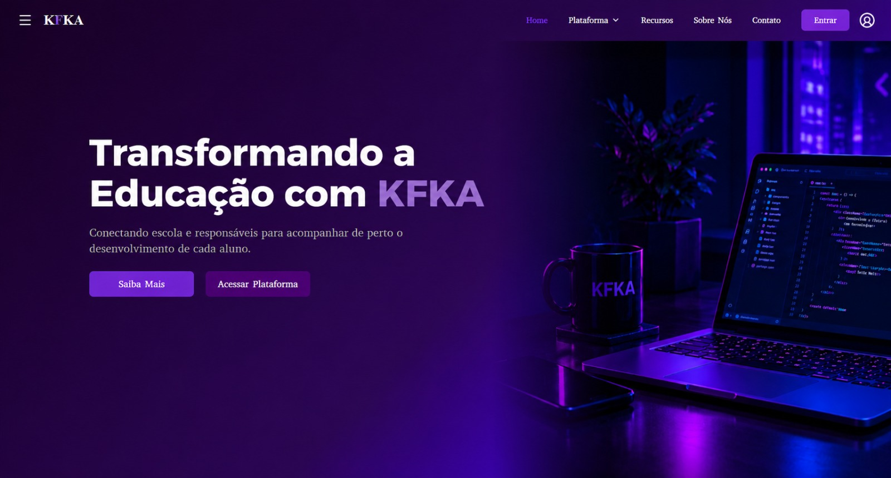

```sh
Utilize o site <https://www.toptal.com/developers/gitignore> para gerar seu arquivo gitignore e apague este campo.

Vide tutoriais do PI.
```

# FECAP - Fundação de Comércio Álvares Penteado

<p align="center">
<a href= "https://www.fecap.br/"></a>
</p>

# PROJETO KFKA

## Sintonia Tech

## Integrantes: <a href="https://www.linkedin.com/in/victorbarq/">Douglas Silva Gadelha Macario</a>, <a href="https://www.linkedin.com/in/victorbarq/">Eric Carvalho</a>, <a href="https://www.linkedin.com/in/victorbarq/">Gabriel Vaz Ferreira Neves</a>, <a href="https://www.linkedin.com/in/victorbarq/">Gustavo Cocoloti Melo</a>

## Professores Orientadores: <a href="https://www.linkedin.com/in/adriano-valente-534576135/" target="_blank" rel="noopener noreferrer"> Adriano Felix Valente </a>, <a href="https://www.linkedin.com/in/eduardo-savino-gomes-77833a10/" target="_blank" rel="noopener noreferrer"> Eduardo Savino Gomes </a>, <a href="https://www.linkedin.com/in/francisco-escobar/" target="_blank" rel="noopener noreferrer"> Francisco de Souza Escobar </a>, <a href="https://www.linkedin.com/in/jbuesso/" target="_blank" rel="noopener noreferrer"> José Carlos Buesso Jr </a>, <a href="https://www.linkedin.com/in/ronaldo-araujo-pinto-3542811a/" target="_blank" rel="noopener noreferrer"> Ronaldo Araujo Pinto </a>

## Descrição

<p align="center">
  
</p>

<br><br>
O KFKA é uma plataforma digital desenvolvida para facilitar o acompanhamento escolar de estudantes do Ensino Fundamental, centralizando o registro e o compartilhamento de informações acadêmicas. Ao final de cada bimestre, os professores podem inserir as médias dos alunos, tags de acompanhamento e observações qualitativas sobre seu desempenho e evolução. Antes da publicação, os registros passam pela análise da gestão escolar, que pode revisar, ajustar, devolver para correção ou aprovar as informações.
Após a aprovação, os responsáveis têm acesso exclusivo aos relatórios dos alunos vinculados aos seus perfis, podendo acompanhar seu desempenho de forma simples e organizada. A plataforma também permite gerar e baixar os relatórios em formato Excel, contribuindo para um melhor gerenciamento dos dados. Dessa forma, o KFKA integra professores, gestão escolar e famílias em um único ambiente, facilitando a comunicação e fortalecendo o acompanhamento pedagógico.
<br><br>
O KFKA reúne essas informações em um único ambiente, organizado de acordo com o perfil de cada usuário.
<br><br>

## 🛠 Estrutura de pastas

Projeto19/
├── documentos/
│   ├── Entrega_1/
│   ├── Banco_de_Dados.pdf
│   └── Design_de_Interface_Digital.pdf
├── imagens/
├── src/
│   ├── Entrega_1/
│   ├── Estrutura_de_Dados/
│   ├── FullStack/
│   └── POO/
├── .gitignore
└── README.md

A pasta raiz contem dois arquivos que devem ser alterados:

<b>README.MD</b>: Arquivo que serve como guia e explicação geral sobre seu projeto. O mesmo que você está lendo agora.

Há também 4 pastas que seguem da seguinte forma:

<b>documentos</b>: Toda a documentação estará nesta pasta.

<b>executáveis</b>: Binários e executáveis do projeto devem estar nesta pasta.

<b>imagens</b>: Imagens do sistema

<b>src</b>: Pasta que contém o código fonte.

## 🛠 Instalação

<b>Android:</b>

Faça o Download do JOGO.apk no seu celular.
Execute o APK e siga as instruções de seu telefone.

```sh
Coloque código do prompt de comnando se for necessário
```

<b>Windows:</b>

Não há instalação! Apenas executável!
Encontre o JOGO.exe na pasta executáveis e execute-o como qualquer outro programa.

```sh
Coloque código do prompt de comnando se for necessário
```

<b>HTML:</b>

Não há instalação!
Encontre o index.html na pasta executáveis e execute-o como uma página WEB (através de algum browser).

## 💻 Configuração para Desenvolvimento

Descreva como instalar todas as dependências para desenvolvimento e como rodar um test-suite automatizado de algum tipo. Se necessário, faça isso para múltiplas plataformas.

Para abrir este projeto você necessita das seguintes ferramentas:

-<a href="https://godotengine.org/download">GODOT</a>

```sh
make install
npm test
Coloque código do prompt de comnando se for necessário
```

## 📋 Licença/License
Utilize o link <https://chooser-beta.creativecommons.org/> para fazer uma licença CC BY 4.0.

## 🎓 Referências

Aqui estão as referências usadas no projeto.

1. <https://github.com/iuricode/readme-template>
2. <https://github.com/gabrieldejesus/readme-model>
3. <https://chooser-beta.creativecommons.org/>
4. <https://freesound.org/>
5. <https://www.toptal.com/developers/gitignore>
<<<<<<< HEAD
6. Músicas por: <a href="https://freesound.org/people/DaveJf/sounds/616544/"> DaveJf </a> e <a href="https://freesound.org/people/DRFX/sounds/338986/"> DRFX </a> ambas com Licença CC 0.
=======
6. Músicas por: <a href="https://freesound.org/people/DaveJf/sounds/616544/"> DaveJf </a> e <a href="https://freesound.org/people/DRFX/sounds/338986/"> DRFX </a> ambas com Licença CC 0.
>>>>>>> 52f04581b6be3bbed242abb2c3704d390df65a66
